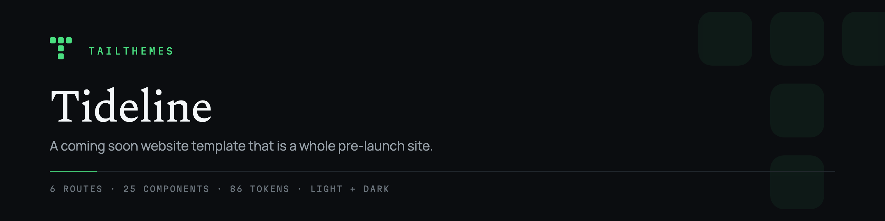
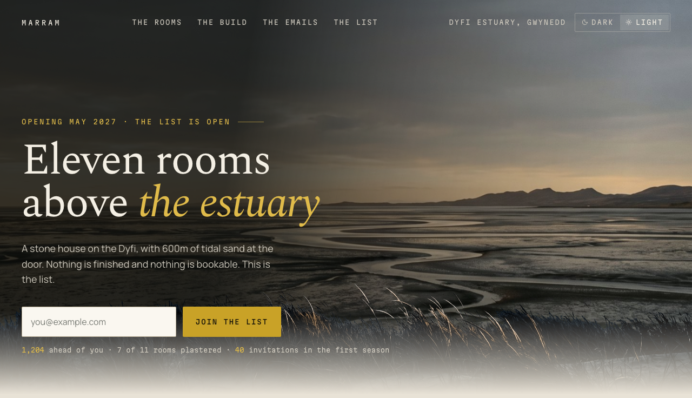
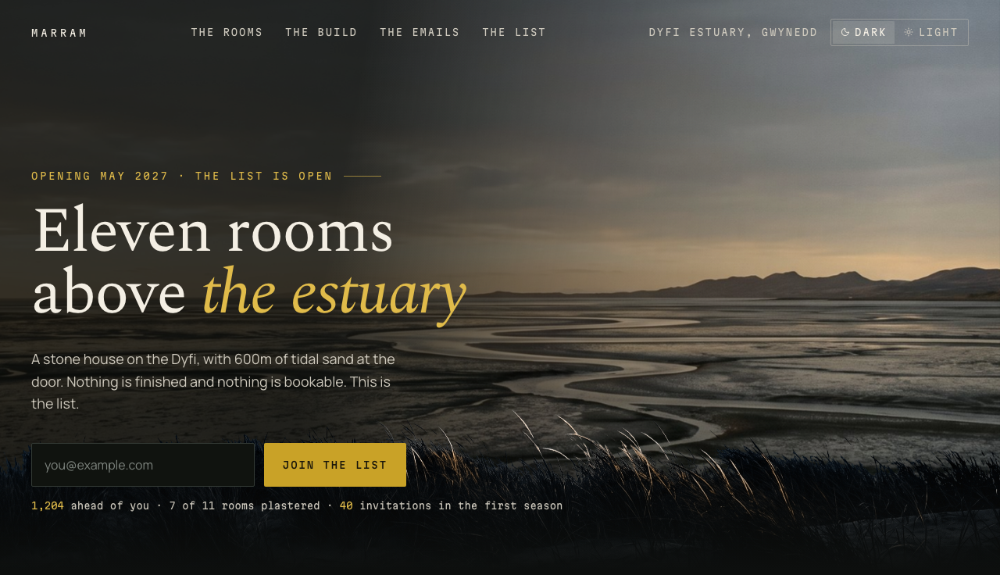

<p align="center">
  
</p>

<p align="center">
  <a href="LICENSE"></a>
  
  
  
  
</p>

# Tideline: coming soon website template

Tideline is a coming soon website template, MIT licensed, for a launch that has nothing to demo yet.

It is a whole pre-launch site instead of one form on a gradient. The demo is a coastal hotel opening in 2027: eleven rooms with a build stage each, a dated build log, a five-email sequence set as HTML, and a page stating what joining the list does and does not mean.

Two editions ship in this repository: a Next.js 15 project in `src/`, and an independently written static site in `html/dist/` that runs with no build step.

[Live demo](https://tailthemes.com/preview/tideline?utm_source=github&utm_medium=readme&utm_campaign=tideline) · [Tideline on tailthemes.com](https://tailthemes.com/themes/tideline?utm_source=github&utm_medium=readme&utm_campaign=tideline)

## Light and dark





The mode is one class on the root element, and both sides of it are tokens in `src/theme.css`. There are no `dark:` utilities to keep in sync, and nothing reads the operating system setting behind your back.

## Quickstart

```sh
bun install
bun dev
```

Then open http://localhost:3000.

The project is bun first, and that is a real constraint rather than a preference: `npm install` and `npm run dev` work, but `build:html` and `preview:html` invoke `bun` directly, so the HTML edition needs it installed either way.

## What's inside

- **6 routes**: `/`, `/rooms`, `/the-build`, `/emails`, `/list`, `/components`
- **25 components**, one file each, every one named in `theme.json`
- **86 design tokens**, each with a dark counterpart, all in `src/theme.css`
- **6 compiled HTML pages** in `html/dist/`, deployable as static files
- **4 agent skills** in `.claude/skills/`: `add-page`, `add-section`, `check-quality`, `rebrand`
- **3 typefaces** self hosted in `src/fonts/`: Manrope, Martian Mono and Spectral
- **1 dependency beyond React and Next.js**: `lucide-react`
- `AGENTS.md`, the file map and invariants, written for the agent in your editor

## Rebrand in one file

Every colour, radius, shadow and type step is a token in `src/theme.css`. Change the values, keep the names, and both editions follow. Nothing under `src/components/` needs an edit.

Agents get the procedure in writing: point yours at `.claude/skills/rebrand`.

## The HTML edition

`html/dist/` is the compiled site: 6 pages, one stylesheet, local fonts, local images, one vanilla script. Upload the folder to any static host. No Node, no framework, no build.

Its source is Nunjucks under `html/src/`. After editing it:

```sh
bun run build:html
bun run preview:html   # http://localhost:4173
```

The HTML edition is written by hand, not exported from React. It imports the same `src/theme.css`, so one token table serves both editions.

## Issues welcome, pull requests closed

This repository is generated from our own source, so a patch merged here is overwritten by the next release. Open an issue instead and the fix lands upstream, then comes back in the next version. Forking is open, which is what the MIT grant is for.

## License

The theme is [MIT licensed](LICENSE). Use it in commercial work, modify it, ship it, resell what you build with it. No attribution required.

The typefaces are not ours to relicense. Manrope, Martian Mono and Spectral ship under the SIL Open Font License 1.1. Each family's license text sits verbatim beside its `.woff2` file in [`src/fonts/`](src/fonts). Keep those files with the fonts and you are within terms.

Every image in the theme was generated by us and is covered by the MIT grant. No stock photography has ever entered a tailthemes.com theme.

## More themes

[Tideline's page](https://tailthemes.com/themes/tideline?utm_source=github&utm_medium=readme&utm_campaign=tideline) has the full preview, the changelog and the download. [The catalog](https://tailthemes.com/templates?utm_source=github&utm_medium=readme&utm_campaign=tideline) has the rest: 2 more free themes and the paid ones, all built the same way.
